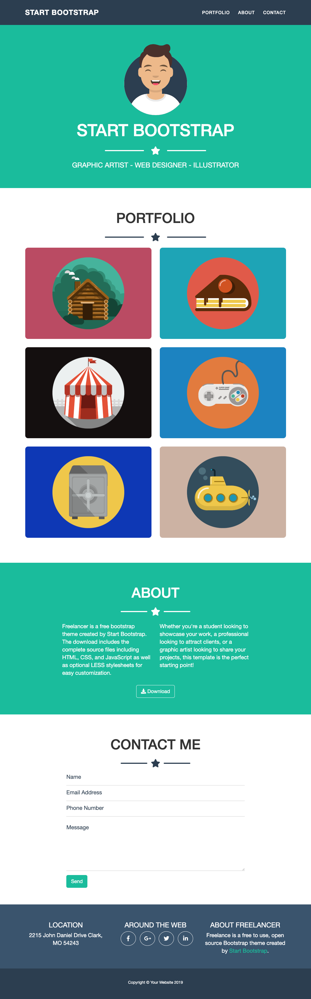

# LEARNING BOOSTRAP BASIS

- css is almost empity, except some utilities used for images color managing and costum items (circle for logos, mid-line for costume element)
- the porpuse of this exercise is learning boostrap so I've used css stylesheet as least as possible

## LAYOUTS

## smartphone

## tablet

## desktop

